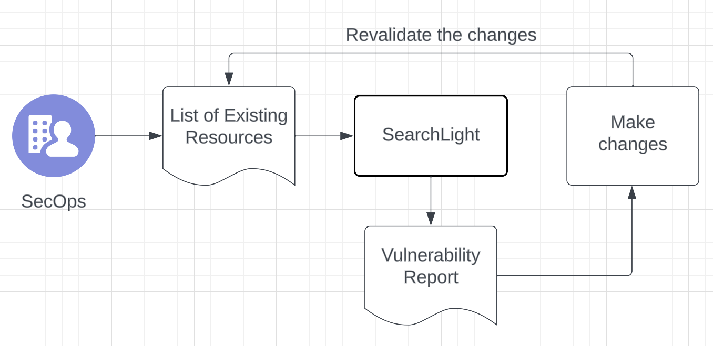

# SearchLight
Review 🔍and protect 🛡️your cloud ☁️infrastructure

## Idea
Use the new feature released from Terraform 1.5 (June 2023) - [config-driven import](https://www.hashicorp.com/blog/terraform-1-5-brings-config-driven-import-and-checks) to generate the Terraform config of the targeted existing infra and use Open AI API to review and suggest any changes that should be made to make it secure.

## Sample workflow

- **Step 1:** A DevSecOps engineer makes a list of all infrastructure that they want reviewed for following security best practices.
  - Sample list config
    ```
    [
      {
        type: "aws_internet_gateway",
        id: "igw-9jodcoo8ncei7"
      },
      {
        type: "aws_instance",
        id: "i-9h8u6efbu8786"
      },
      // ... (other resources)
    ]
    ```
- **Step 2:** Run the searchlight library to review the config of the specified resources and get recommendation report
```shell
python searchlight.py <file_path of the list file from step 1>
```
- **Step 3:** Review the generated suggestions and make the changes to make the resources secure.
  - Note: Be careful not to have any unintended consequences making changes to resources in production environment.